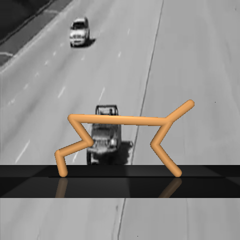

[Andrew Fowler]: https://www.linkedin.com/in/andrew-fowler-398a88190/?originalSubdomain=uk
[Austin R. Benson]: https://www.cs.cornell.edu/~arb/
[Benson Chen]: https://scholar.google.com/citations?user=EZQHjx4AAAAJ&hl=en
[Bradley D. Olsen]: https://cheme.mit.edu/profile/bradley-d-olsen/
[Claudio Zeni]: https://scholar.google.com/citations?user=QujxEwQAAAAJ&hl=en
[Donghyun Kim]: https://www.cics.umass.edu/people/kim-donghyun
[Daniel Zügner]: https://scholar.google.de/citations?user=zLYI3MwAAAAJ&hl=de
[Ge Yang]: https://www.episodeyang.com/
[Gabriel Margolis]: https://gmargo11.github.io/
[Lixin Sun]: https://scholar.google.com/citations?user=yGsgDEgAAAAJ&hl=en
[Kartik Paigwar]: https://kartikpaigwar.github.io/
[Nathan J. Rebello]: https://nathanrebello.com/#
[Octavian Ganea]: https://people.csail.mit.edu/oct/
[Pulkit Agrawal]: http://people.csail.mit.edu/pulkitag/
[Regina Barzilay]: https://www.regina.csail.mit.edu/
[Robert Pinsler]: https://rpinsler.github.io/
[Sangbae Kim]: https://meche.mit.edu/people/faculty/SANGBAE@MIT.EDU
[Shangdi Yu]: https://yushangdi.github.io/
[Sinan Keten]: https://www.mccormick.northwestern.edu/research-faculty/directory/profiles/keten-sinan.html
[Rafael Gomez-Bombarelli]: http://gomezbombarelli.mit.edu/
[Tao Chen]: https://taochenshh.github.io/
[Tian Xie]: http://txie.me/
[Tommi Jaakkola]: https://people.csail.mit.edu/tommi/tommi.html
[Wujie Wang]: https://wwj.mit.edu/
[Zhenghao Wu]: https://chenghao-wu.github.io/
[Andrew Rosen]: https://cbe.princeton.edu/people/andrew-rosen
[Jake Smith]: https://www.microsoft.com/en-us/research/people/jakesmith/
[Albert Musaelian]: https://scholar.google.com/citations?user=6CGJH_oAAAAJ&hl=en
[Anders Johansson]: https://scholar.google.co.uk/citations?user=C25gxlIAAAAJ&hl=en
[Boris Kozinsky]: https://mir.g.harvard.edu/people/boris-kozinsky
[Yandong Ji]: https://yandongji.github.io/
[Kyle Bystrom]: https://scholar.google.com/citations?user=r1EA_vYAAAAJ&hl=en
[Rui Wang]: https://rui1521.github.io/online-cv/
[Tess Smidt]: https://blondegeek.github.io/
[Cameron Owen]: https://scholar.google.com/citations?user=uniXyQ0AAAAJ&hl=en
[Yu Xie]: https://www.microsoft.com/en-us/research/people/yuxie1/
[Blake Duschatko]: https://scholar.google.com/citations?user=wWiwYlsAAAAJ&hl=en
<!--  -->

For a full list of publications, please refer to my [Google Scholar](https://scholar.google.com/citations?user=Cb-ZgHEAAAAJ&hl=en) page.

# Selected Papers

**UMA: A Family of Universal Models for Atoms.** 
Brandon M. Wood\*, Misko Dzamba\*, Xiang Fu\*, Meng Gao\*, Muhammed Shuaibi\*, Luis Barroso-Luque, Kareem Abdelmaqsoud, Vahe Gharakhanyan, John R. Kitchin, Daniel S. Levine, Kyle Michel, Anuroop Sriram, Taco Cohen, Abhishek Das, Ammar Rizvi, Sushree Jagriti Sahoo, Zachary W. Ulissi, C. Lawrence Zitnick.  
*Preprint, 2025.*  
[[paper]](https://ai.meta.com/research/publications/uma-a-family-of-universal-models-for-atoms/) [[code]](https://github.com/FAIR-Chem/fairchem) [[checkpoint]](https://huggingface.co/facebook/UMA)

**Learning Smooth and Expressive Interatomic Potentials for Physical Property Prediction.**  
Xiang Fu, Brandon M. Wood, Luis Barroso-Luque, Daniel S. Levine, Meng Gao, Misko Dzamba, C. Lawrence Zitnick.  
*International Conference on Machine Learning (ICML), 2025.*  
[[paper]](https://arxiv.org/abs/2502.12147) [[code]](https://github.com/FAIR-Chem/fairchem) [[checkpoint]](https://huggingface.co/facebook/OMAT24)

**A Generative Model for Inorganic Materials Design.**  
Claudio Zeni\*, Robert Pinsler\*, Daniel Zügner\*, Andrew Fowler\*, Matthew Horton\*, Xiang Fu, Zilong Wang, Aliaksandra Shysheya, Jonathan Crabbé, Shoko Ueda, Roberto Sordillo, Lixin Sun, Jake Smith, Bichlien Nguyen, Hannes Schulz, Sarah Lewis, Chin-Wei Huang, Ziheng Lu, Yichi Zhou, Han Yang, Hongxia Hao, Jielan Li, Chunlei Yang, Wenjie Li, Ryota Tomioka\*, [Tian Xie]\*.  
*Nature, 2025.*  
[[paper]](https://www.nature.com/articles/s41586-025-08628-5) [[code]](https://github.com/microsoft/mattergen)

**A Recipe for Charge Density Prediction.**  
Xiang Fu, [Andrew Rosen], [Kyle Bystrom], [Rui Wang], [Albert Musaelian], [Boris Kozinsky], [Tess Smidt], [Tommi Jaakkola].  
*Neural Information Processing Systems (NeurIPS), 2024.*  
[[paper]](https://arxiv.org/abs/2405.19276) [[code]](https://github.com/kyonofx/scdp)

**MOFDiff: Coarse-grained Diffusion for Metal-Organic Framework Design.**  
Xiang Fu, [Tian Xie], [Andrew Rosen], [Tommi Jaakkola], [Jake Smith].  
*International Conference on Learning Representations (ICLR), 2024.*  
[[paper]](https://arxiv.org/abs/2310.10732) [[code]](https://github.com/microsoft/MOFDiff)

**Simulate Time-integrated Coarse-grained Molecular Dynamics with Multi-scale Graph Networks.**  
Xiang Fu\*, [Tian Xie]\*, [Nathan J. Rebello], [Bradley D. Olsen], [Tommi Jaakkola].  
*Transactions on Machine Learning Research (TMLR), 2023.*  
[[paper]](https://openreview.net/forum?id=y8RZoPjEUl) [[code]](https://xiangfu.co/mlcgmd)

**Forces are not Enough: Benchmark and Critical Evaluation for Machine Learning Force Fields with Molecular Simulations.**  
Xiang Fu, [Zhenghao Wu], [Wujie Wang], [Tian Xie], [Sinan Keten], [Rafael Gomez-Bombarelli], [Tommi Jaakkola].  
*Transactions on Machine Learning Research (TMLR), 2023.*  
[[paper]](https://openreview.net/forum?id=A8pqQipwkt) [[code]](https://github.com/kyonofx/MDsim)

**Crystal Diffusion Variational Autoencoder for Periodic Material Generation.**  
[Tian Xie]\*, Xiang Fu\*, [Octavian Ganea]\*, [Regina Barzilay], [Tommi Jaakkola].  
*International Conference on Learning Representations (ICLR), 2022.*  
[[paper]](https://arxiv.org/abs/2110.06197) [[code]](https://github.com/txie-93/cdvae)

**Learning Task Informed Abstractions.**  
Xiang Fu\*, [Ge Yang]\*, [Pulkit Agrawal], [Tommi Jaakkola].  
*International Conference on Machine Learning (ICML), 2021.*  
[[paper]](https://arxiv.org/abs/2106.15612) [[code]](https://github.com/kyonofx/tia)

<!-- **Thermodynamically Informed Multimodal Learning of High-Dimensional Free Energy Models in Molecular Coarse Graining.**  
[Blake Duschatko], Xiang Fu, [Cameron Owen], [Yu Xie], [Albert Musaelian], [Tommi Jaakkola], [Boris Kozinsky].  
*Preprint, 2024.*  
[[paper]](https://arxiv.org/abs/2405.19386) -->

<!-- **Virtual Node Graph Neural Network for Full Phonon Prediction.**  
Ryotaro Okabe, Abhijatmedhi Chotrattanapituk, Artittaya Boonkird, Nina Andrejevic, Xiang Fu, [Tommi Jaakkola], Qichen Song, Thanh Nguyen, Nathan Drucker, Sai Mu, Bolin Liao, Yongqiang Cheng, Mingda Li  
*Nature Computational Science, 2024.*  
[[paper]](https://arxiv.org/abs/2301.02197) [[code]](https://github.com/RyotaroOKabe/phonon_prediction) -->

<!-- **Learning to See Physical Properties with Active Sensing Motor Policies.**  
[Gabriel Margolis], Xiang Fu, [Yandong Ji], [Pulkit Agrawal]  
*Conference on Robot Learning (CoRL), 2023.*  
[[website]](https://gmargo11.github.io/active-sensing-loco/) [[paper]](https://openreview.net/forum?id=RQ_7yVV8vA)

**Learning to Jump from Pixels.**  
[Gabriel Margolis], [Tao Chen], [Kartik Paigwar], Xiang Fu, [Donghyun Kim], [Sangbae Kim], [Pulkit Agrawal].  
*Conference on Robot Learning (CoRL), 2021.*  
[[website]](https://sites.google.com/view/jumpingfrompixels)
[[paper]](https://openreview.net/forum?id=R4E8wTUtxdl) -->